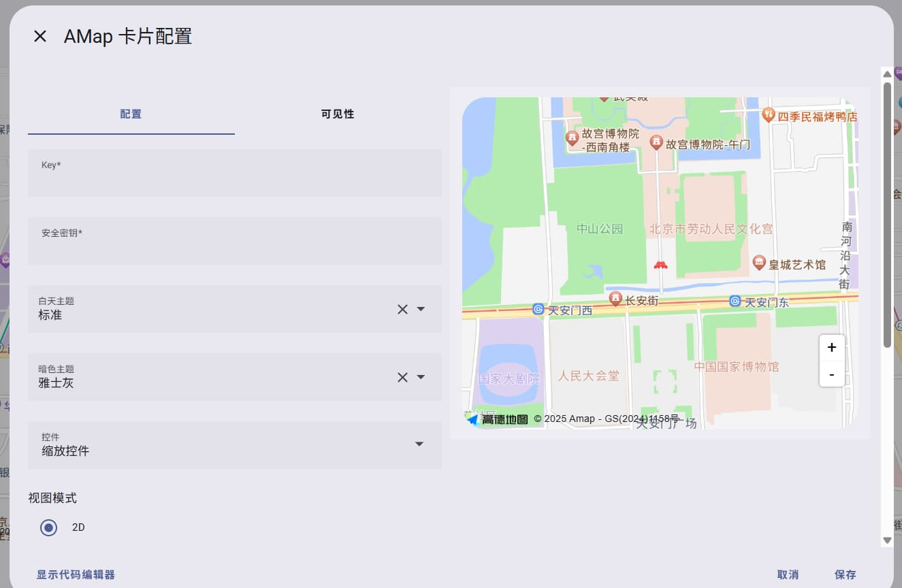

# Lovelace AMap Card

Home Assistant 的高德地图卡片。

## 安装

### 申请高德地图 API Key

[高德地图开放平台](https://lbs.amap.com/api/javascript-api-v2/prerequisites)

### 使用 [HACS](https://hacs.xyz/) 安装

HACS > 右上角三个点 > Custom repositories > Repository: https://github.com/sugarscat/lovelace-amap-card.git & Category or Type: Dashboard > ADD > 点击 HACS 的 New 或 Available for download 分类下的“高德地图卡片”，进入集成详情页 > DOWNLOAD

### 手动安装

1. 将 [amap-card.js](dist/amap-card.js) 复制到 `Home Assistant 配置目录/www` 文件夹。
2. 仪表盘 > 右上角三个点 > 资源 > 添加资源 > 网址：`/local/amap-card.js`, 选择 `JavaScript` 模块.

## 截图

## 致谢

### 贡献者

感谢您对项目的贡献！

### 开源软件

这款软件的诞生离不开以下支持：

| 项目                                                                 |                                   许可证                                   |
| -------------------------------------------------------------------- | :-------------------------------------------------------------------------: |
| [boilerplate-card](https://github.com/custom-cards/boilerplate-card) | [MIT](https://github.com/custom-cards/boilerplate-card/blob/master/LICENSE) |
| [ha-map-card](https://github.com/nathan-gs/ha-map-card) | [MIT](https://github.com/nathan-gs/ha-map-card/blob/main/LICENSE) |
